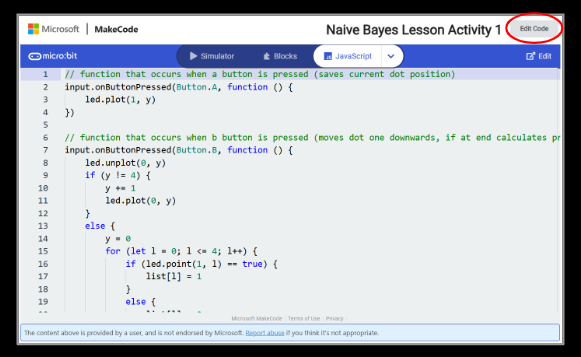
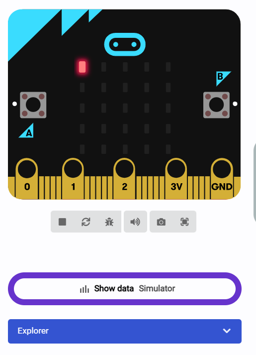
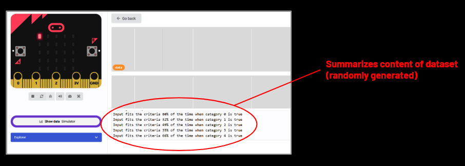
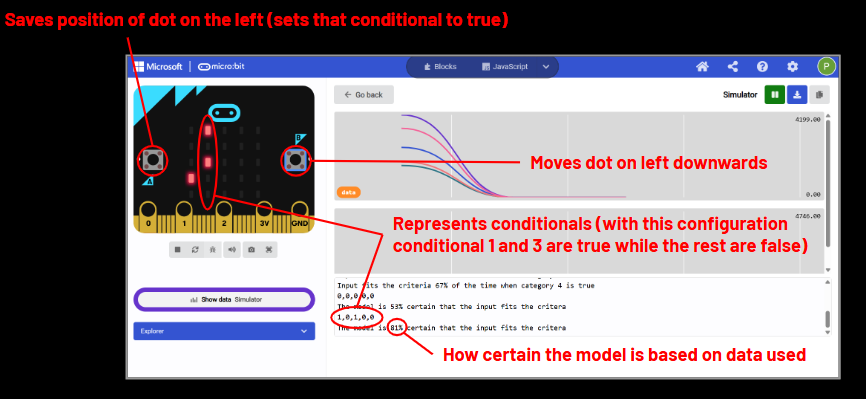

# Naives Bayes Micro:Bit Activity

I created this short activity on the Micro:Bit which can demonstrate the basic mechanics of Naive Bayes, as a supplementary material to a lesson.

## Background Info

### On Naive Bayes

Naive Bayes are simple probabilistic classifiers which attempt to find if a input meets certain critera based on if it meets or doesn't meet specific conditionals. For example, it could look at thigs like if object is green and the object is a reptile, and decide there is a high chance that the object is an alligator based on the given info.

Naive Bayes are extremely effective for simple problems, as they can be run quickly and don't take many resources, but can fall short for more complex issues. This is due to Naive Bayes always assuming that all of the conditionals are independent (this is where the Naive part comes from) which can lead to difficulty in understanding things that require context. It is best for tasks like identifying spam emails, where key words and phrases (independent of each other) can be used to fairly reliably identify spam.

## How to Use

The activity utilizes the columns of LEDs on the front of the Micro:Bit, with each one representing a conditional, to show the thinking process of a model utilizing Naive Bayes. 

### Activity Explanation

As an example, let's say we are using our model to filter spam emails. For our purpose, conditional one might be the phrase "Hello,". Selecting this as true would signal to the algorithm that the phrase "Hello," is contained in the email.

The algorithm could use preexisting data to try and determine if the email is a spam email based on whether or not the conditional is true, utilizing a Naive Bayes algorithm. If most emails that have the phrase "Hello," in the training data are spam emails, then the email having that phrase could indicate to the model that the email might be spam. For the activity, the data is randomly generated.

The values for the data and the probabilities of the object meeting the criteria when certain conditionals are true will be displayed in the serial upon starting the program.

The user would either press the "A" button on the Micro:Bit to signal that the conditional is true, or the "B" button to move to the next conditional. When pressing "B" on the last conditional, the Micro:Bit will then save the set of conditionals.

After the set is inputted, the model will output the certainty that the object meets the criteria in the serial. 

Going back to our example, the email could contains "Hello," and "Goodbye." but not "Thank You." (in this case conditional 1 and 2 would be true and 3 would be false). Based on the training data, the model is 93% sure the email is a spam email.

This will allow students to see the decision making process of Naive Bayes more in depth. They can also examine the code, which is relatively simple, to more closely observe.

### Picture Guide

The code can be run without a physical microbit using the simulator linked here:
https://makecode.microbit.org/S14540-84699-61299-29067

To do this, first press on the edit code button after clicking the link.

Then click on the "Show Data" button on the left side of the screen.

From there you can observe the data.

The code can also be run on the physical Micro:Bit, but this is not necessary.
